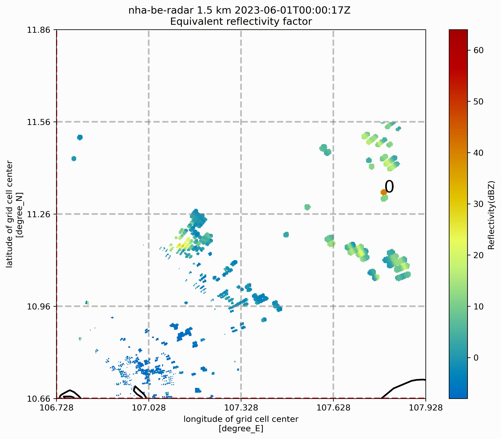
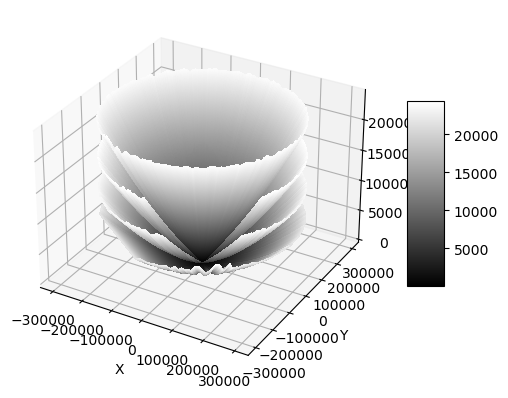
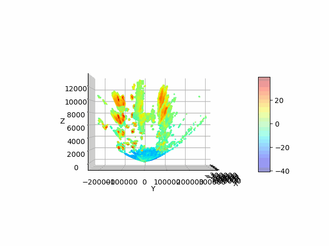

# THESIS 231
* HCMUT-VNU
* Authors:
    - Le Ba Dung
    - Nguyen Phuc Dang
    - Nguyen Huu Hieu
# Enviroment configuration
1. Install [conda](https://conda.io/projects/conda/en/latest/user-guide/install/index.html).
2. Create a new conda environment:
```
conda env create --name <new_environment> -f\
 base_environment.yml
```
3. Use this enviroment for all the Jupyter Notebooks.
# Description:
* In Vietnamese:

Bão là một trong những hiện tượng tự nhiên gây nguy hiểm và thiệt hại nghiêm trọng đối với con người trên thế giới nói chung và Việt Nam nói riêng. Theo thống kê của Tổng cục Phòng chống thiên tai(Bộ NN-PTNT), trong năm 2022(tính đến ngày 19/12/2022), thiên tai ở nước ta đã làm 175 người chết, mất tích và đồng thời thiệt hại về kinh tế ước khoảng 19.452 tỷ đồng. Để đưa ra những biện pháp xử lý, phòng ngừa và ứng phó thiên tai một cách hiệu quả bão đòi hỏi ta phải có sự quan sát và dự báo chính xác về sự hình thành, đường đi, hướng di chuyển của các cơn bão. Vì vậy trong nhiều năm gần đây, đã có rất nhiều nỗ lực được nghiên cứu và phát triển để nâng cao khả năng quan sát và dự báo bão.

Trong lĩnh vực quan sát bão, Radar thời tiết(đa số là Radar Dopler) đã chứng tỏ được tính hiệu quả và độ tin cậy của mình. Radar thời tiết có khả năng phát hiện và đo lường các thông số quan trọng như tốc độ gió, hướng gió, mật độ mây, và đặc biệt là độ phản xạ của các vùng mây(tiếng anh là reflectivity) trong bão. Độ phản xạ này cho phép xác định sự phát triển và di chuyển cũng như là sự mất đi của bão trong thời gian thực.

Tuy nhiên, hệ thống quan sát dựa trên radar thời tiết hiện tại chủ yếu dựa vào thông tin 2 chiều(2D), giới hạn khả năng xem xét không gian 3 chiều(3D) của bão. Điều này có thể gây ra sự thiếu chính xác trong việc đánh giá và dự báo vị trí di chuyển của bão, đồng thời hạn chế khả năng cung cấp thông tin chi tiết về cấu trúc và tiềm năng khác của bão mà ta chưa thể xem xét tới.

Với mục tiêu nâng cao khả năng quan sát và dự báo bão, đề tài này tập trung vào việc phát triển hệ thống quan sát 3D dựa trên độ phản xạ đo được của radar thời tiết. Bằng cách kết hợp các công nghệ và phương pháp tiên tiến, hệ thống này sẽ cung cấp khả năng quan sát không gian 3D của bão, cho phép phân tích chi tiết về cấu trúc và phát triển của bão trong thời gian thực.


# Data
Data in the folder './Data/' is the Nha Be weather radar records, contains:

    - Records from 01/06/2023: they had already been splitted into 2 folders that present for 2 sweeping mode 'fixed' and 'dual'.

    - Records from 02/06/2023: Raw data.

    - Records from 03/06/2023: Raw data.

# Storm tracking and analyze
## TINT

# 3-D Visualization for Reflectivity
* Display radar's sweeps:


* Reflectivities on each sweep:

